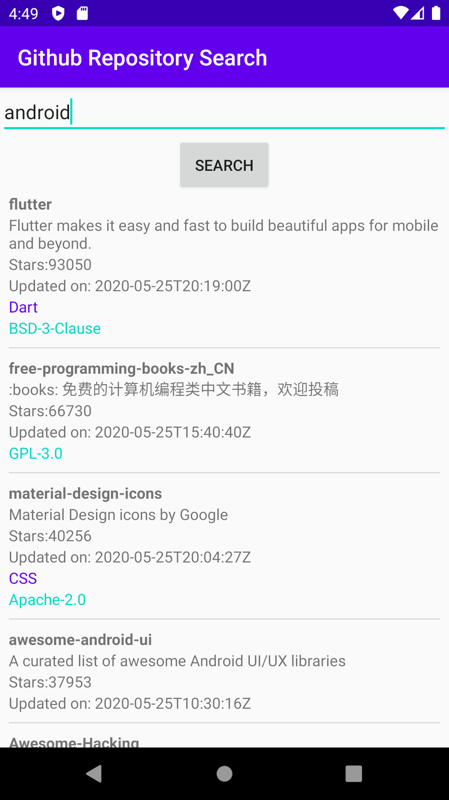

# Github-Repository-Search
Android app to search for github repositories.

The goal is for the app to cover most of the core concepts in Android. On my blog I have covered how I implemented the following concepts:

1. [Introduction and setup](https://www.avinsharma.com/android-basics-intro/)
2. [AsyncTask](https://www.avinsharma.com/android-basics-async-task/)
3. [JSON Parsing](https://www.avinsharma.com/android-basics-json-parsing/)
4. [RecyclerView - I](https://www.avinsharma.com/android-basics-recyclerview-I/)

